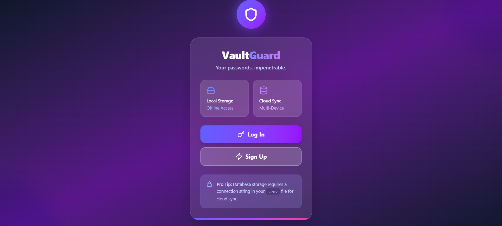
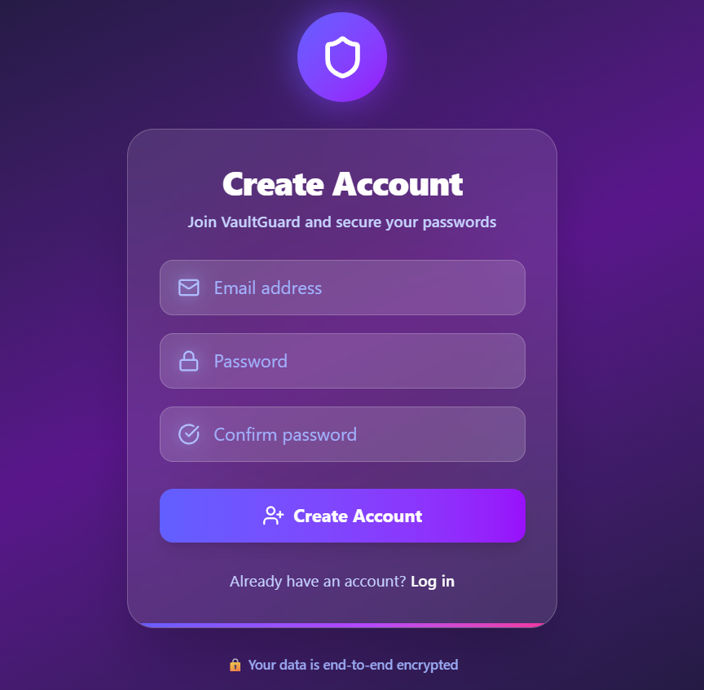
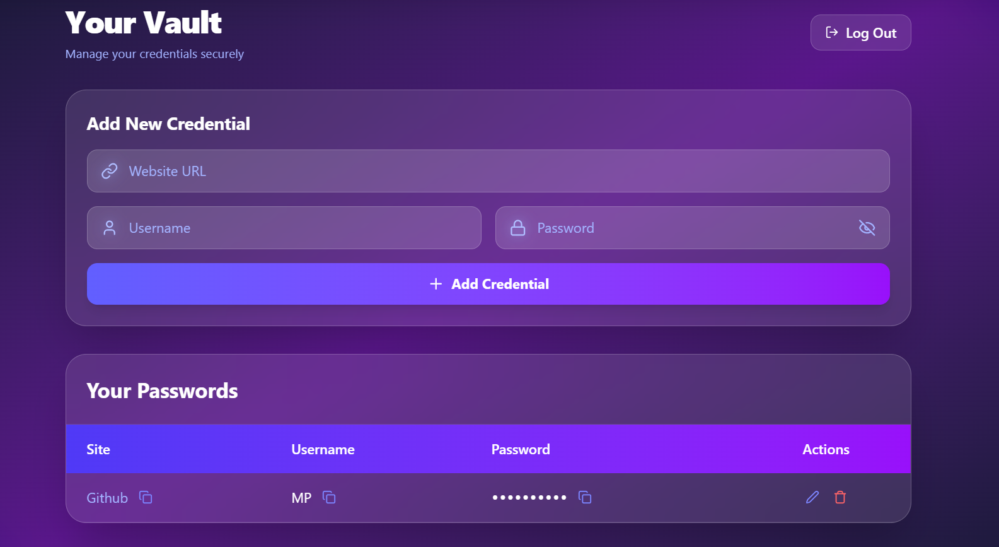

# 🔐 VaultGuard - Full-Stack Password Manager

A secure **full-stack password manager** built using the **MERN stack**, supporting **two storage modes**:

1. **LocalStorage Mode** – Offline, browser-only storage  
2. **Database Mode** – Online, MongoDB-based storage with authentication  

---

## ✨ Features

- 🔒 User authentication (Sign-up / Login / Logout)
- 🎫 JWT authentication using HTTP-only cookies
- 🔐 Secure password hashing with bcrypt
- ✏️ Add, edit, and delete saved passwords
- 💾 Two storage options: LocalStorage or MongoDB
- 🎨 Modern UI with dark glassmorphism design
- 📋 Copy to clipboard functionality

---

## 🧠 Storage Modes Explained

### 1️⃣ LocalStorage Mode (Offline)

- Passwords stored **only in the browser**
- No backend or database required
- Works completely offline
- Data is device-specific
- Best for personal use or learning projects

⚠️ **Warning:** Clearing browser data will remove all saved passwords.

### 2️⃣ Database Mode (Online – Recommended)

- Passwords stored securely in **MongoDB**
- Requires backend server
- Data linked to user accounts
- Accessible across devices
- Suitable for real-world applications

---

## 🚀 Quick Start

### Prerequisites

- Node.js (v14 or higher)
- MongoDB (for Database Mode)
- npm or yarn

---

## 🔁 Setup Instructions

### ✅ LocalStorage Mode (Offline)

1. **Clone/download the Frontend folder**

2. Navigate to:
   ```
   Frontend/src/components/Manager.jsx
   ```

3. **Enable LocalStorage code:**
   ```js
   // ✅ ENABLE this
   useEffect(() => {
     const passwords = localStorage.getItem("passwords");
     if (passwords) {
       setPasswordArray(JSON.parse(passwords));
     }
   }, []);
   
   localStorage.setItem("passwords", JSON.stringify(passwordArray));
   
   // ❌ DISABLE backend fetch
   // fetch("http://localhost:3000/passwords", {
   //   credentials: "include",
   // });
   ```

4. Install and run:
   ```bash
   cd Frontend
   npm install
   npm run dev
   ```

✅ **No backend required • No login required**

---

### ✅ Database Mode (Recommended)

#### 1. Setup Backend

```bash
cd Backend
npm install
```

Create `.env` file in `Backend` folder:
```env
PORT=3000
JWT_SECRET=your_secret_key_here
MONGO_URI=your_mongodb_connection_string
```

Get MongoDB URI from [MongoDB Atlas](https://www.mongodb.com/cloud/atlas) (free tier available)

Start backend:
```bash
npm start
```

#### 2. Setup Frontend

```bash
cd Frontend
npm install
npm run dev
```

Make sure API calls are **enabled** in `Manager.jsx` (default state)

---

## 🔐 Authentication Flow

```
User Sign-up / Login
       ↓
JWT token created
       ↓
Stored in HTTP-only cookie
       ↓
Cookie sent with every request
       ↓
Auth middleware validates user
       ↓
Access granted
```

---

## 🛠 Tech Stack

**Frontend:** React, Vite, Tailwind CSS, Lucide React  
**Backend:** Node.js, Express, MongoDB, Mongoose  
**Security:** JWT, bcrypt, HTTP-only cookies

---

## 📁 Project Structure

```
password-manager/
│
├── Frontend/
│   ├── src/
│   │   ├── components/
│   │   │   ├── WelcomePage.jsx
│   │   │   ├── Login.jsx
│   │   │   ├── Signin.jsx
│   │   │   └── Manager.jsx
│   │   └── App.jsx
│   └── package.json
│
└── Backend/
    ├── models/
    ├── routes/
    ├── middleware/
    ├── server.js
    └── .env
```

---

## 🐛 Troubleshooting

**Backend won't start:**
- Check if MongoDB is running
- Verify `.env` configuration
- Ensure port 3000 is available

**Frontend can't connect:**
- Verify backend is running on `http://localhost:3000`
- Check `credentials: "include"` in fetch requests

**Authentication issues:**
- Clear browser cookies
- Verify JWT_SECRET in `.env`

---

## 📸 Screenshots

### Welcome Page


### Login Page


### Sign Up Page


### Password Manager


---

## 🔮 Future Enhancements

- [ ] Password strength indicator
- [ ] Two-factor authentication (2FA)
- [ ] Password generator
- [ ] Browser extension
- [ ] Import/Export functionality

---
